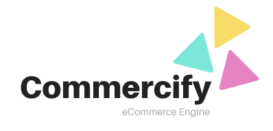

By: 
<a href="https://linkedin.com/in/imzeeshan">Zeeshan Chawdhary</a>

## About Commercify

Commercify is an opensource eCommerce Engine, written for my book "Practical Laravel".

It uses the awesome Stisla dashboard theme and Laravel Modules to build a modular eCommerce store.

The book teaches the various aspects of CMS development, building an eCommerce store and a few other tricks.

##Todo
Removed lighthouse due to conflict. Check back later for GraphQL....

      "nuwave/lighthouse": "^v4.16.3"

##Tips

Run composer with

COMPOSER_MEMORY_LIMIT=-1

## License

The Laravel framework is open-sourced software licensed under the [MIT license](https://opensource.org/licenses/MIT).
